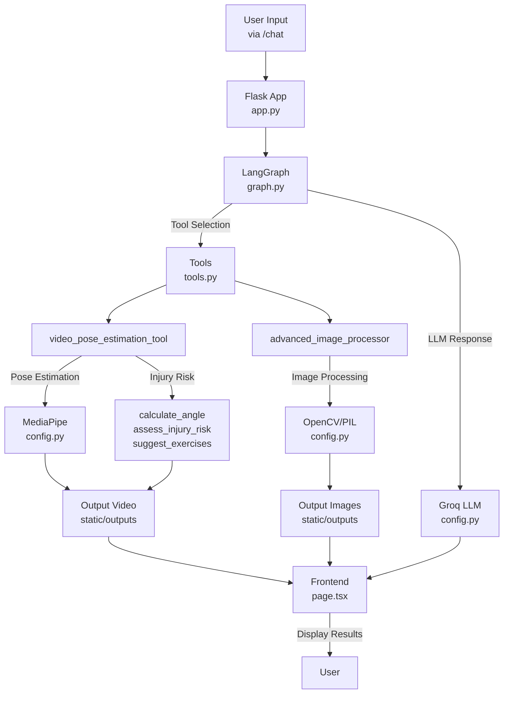

# 🏏BharatShot: Cricket Biomechanics AI

Welcome to **Biomechanics AI**, a cutting-edge web application that transforms cricket training with AI-powered video analysis! 📹 This app analyzes batting videos to assess posture, calculate swing speed, evaluate injury risks (back, knees, shoulders), and suggest personalized exercises. Powered by a sleek **Next.js** frontend with immersive 3D visuals (React Three Fiber) and a robust **Flask** backend with MediaPipe and LangGraph, it’s designed for cricketers, coaches, and sports tech enthusiasts. 🚀

This project is paired with a 1.5-minute demo video showcasing its high-tech UI and actionable insights [See the LinkedIn post](https://www.linkedin.com/posts/arav-saxena-a081a428a_ai-healthcareai-sportstech-activity-7355099042340581377-eBco?utm_source=social_share_send&utm_medium=member_desktop_web&rcm=ACoAAEYmtqgBuJnxMujvnlsSXRA6pD9JomTH6Ag).

## 🎯 Features
- **Video Analysis**: Upload batting videos to analyze posture and swing mechanics using MediaPipe pose estimation.
- **Injury Risk Assessment**: Evaluates risks to back, knees, and shoulders based on biomechanical data.
- **Swing Speed Calculation**: Measures bat swing speed for performance insights.
- **Exercise Recommendations**: Provides tailored exercises to improve technique and reduce injury risk.
- **3D Visualization**: Stunning 3D cricket scene with animated ball, bat, and wickets using React Three Fiber.
- **Interactive UI**: Engaging Next.js frontend with Framer Motion animations and Lucide React icons.

## 🛠️ Tech Stack
- **Frontend**: Next.js, React Three Fiber, Framer Motion, Lucide React, Tailwind CSS
- **Backend**: Flask, LangChain, LangGraph, MediaPipe, OpenCV, NumPy, Matplotlib, PIL
- **AI Model**: Groq (via LangChain, `llama4`)
- **Deployment**: Local development (extendable to Vercel/Heroku)

## 📂 Project Structure
```
cricket-biomechanics-ai/
├── frontend/
│   └── app/
│       └── page.tsx           # Next.js frontend with 3D visuals and UI
├── backend/
│   ├── app.py                 # Flask app with API endpoints
│   ├── config.py              # Logging, env vars, MediaPipe, and LLM setup
│   ├── graph.py               # LangGraph workflow for tool execution
│   ├── tools.py               # Video and image processing tools
│   ├── static/
│   │   ├── uploads/           # Directory for uploaded videos
│   │   ├── outputs/           # Directory for processed videos/images
├── README.md                  # Project documentation
└── requirements.txt           # Python dependencies
```

## ⚙️ Installation

### Prerequisites
- **Node.js**: Version 18 or higher (`node -v`)
- **Python**: Version 3.8 or higher (`python --version`)
- **Git**: For version control
- **FFmpeg**: Required for video processing with OpenCV (install via `brew install ffmpeg` on macOS or `sudo apt install ffmpeg` on Linux)

### Backend Setup
1. **Clone the Repository**:
   ```bash
   git clone <repository-url>
   cd cricket-biomechanics-ai/backend
   ```
2. **Create a Virtual Environment**:
   ```bash
   python -m venv venv
   source venv/bin/activate  # On Windows: venv\Scripts\activate
   ```
3. **Install Dependencies**:
   ```bash
   pip install flask flask-cors opencv-python mediapipe numpy matplotlib pillow langchain langgraph typing-extensions requests
   ```
4. **Run the Flask Server**:
   ```bash
   python app.py
   ```
   The backend will be available at `http://localhost:5001`.

### Frontend Setup
1. **Navigate to the Frontend Directory**:
   ```bash
   cd ../frontend
   ```
2. **Install Dependencies**:
   ```bash
   npm install @react-three/fiber @react-three/drei framer-motion lucide-react three
   ```
3. **Run the Next.js App**:
   ```bash
   npm run dev
   ```
   The frontend will be available at `http://localhost:3000`.

## 🚀 Usage
1. **Upload a Video**: Open `http://localhost:3000`, click the upload button, and select a cricket batting video (MP4 format recommended).
2. **Analyze**: Use the chat interface to enter commands like:
   - "Analyze batting posture"
   - "Assess injury risk"
   - "Calculate swing speed"
3. **View Results**: Check the UI for:
   - Injury risk assessment (back, knees, shoulders)
   - Swing speed metrics
   - Personalized exercise recommendations
   - Annotated video with pose estimation overlays
4. **Download Results**: Save the processed video from the frontend.
5. **Debug**: Access `http://localhost:5001/debug/analysis` to inspect the analysis cache and output files.

## 🧠 Tools and Agentic Flow
The backend uses a LangGraph workflow to orchestrate AI-driven analysis. The diagram below illustrates how the tools and agent interact:



### Flow Explanation
1. **User Input**: Users upload videos and send commands via the frontend, hitting the `/chat` endpoint (`app.py`).
2. **LangGraph**: The LangGraph workflow (`graph.py`) processes the input, selecting appropriate tools based on the command.
3. **Tools**:
   - `video_pose_estimation_tool`: Uses MediaPipe for pose estimation, calculates angles, assesses injury risks, and suggests exercises (`tools.py`).
   - `advanced_image_processor`: Processes images with OpenCV/PIL for custom analysis (`tools.py`).
4. **LLM**: Grok (`config.py`) generates responses and coordinates tool execution.
5. **Output**: Processed videos/images are saved to `static/outputs` and served to the frontend for display.

## 📽️ Viral Video Demo
The project includes a 1.5-minute demo video for viral sharing:
- **0:00–0:10**: Showcases batting footage uploaded to the app.
- **0:10–0:55**: Highlights the 3D UI, video upload animation, and analysis results (injury risks, exercises).
- **0:55–1:15**: Displays the annotated video with pose overlays.
- **1:15–1:30**: Closes with a call-to-action and app logo/QR code.

Record the demo using tools like OBS Studio, and generate a QR code linking to your app at `qr-code-generator.com`.

## 🐛 Troubleshooting
- **Backend Errors**:
  - Ensure FFmpeg is installed for video processing (`ffmpeg -version`).
  - Check `http://localhost:5001/health` for server status.
  - Review logs in `app.py` output or `http://localhost:5001/debug/analysis`.
- **Frontend Issues**:
  - Verify WebGL is enabled in your browser for 3D visuals.
  - Reinstall dependencies if modules fail:
    ```bash
    npm install three @react-three/fiber @react-three/drei
    ```
- **Video Playback**: If processed videos don’t play, ensure the backend uses `mp4v` or `H264` codec in `tools.py`.

## 🌟 Contributing
1. Fork the repository.
2. Create a feature branch: `git checkout -b feat/your-feature`.
3. Commit changes using conventional commits:
   ```bash
   git commit -m "feat(module): add new feature description"
   ```
4. Push and create a pull request.

## 📜 License
MIT License. See `LICENSE` for details.

## 📬 Contact
For feedback or collaboration, reach out via [LinkedIn](#) or open an issue. Let’s revolutionize cricket training together! 🏏

---

*Built with 💻 by Arav for cricket enthusiasts and tech innovators.*
```
